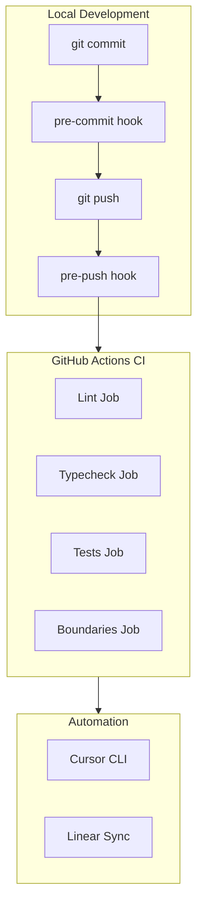

# CI/CD Architecture

## Overview

ALFRED uses a streamlined CI/CD pipeline that catches issues early, runs fast, and automates routine tasks. The pipeline consists of local git hooks, GitHub Actions workflows, and automation integrations.

## Architecture



## Components

### Local Git Hooks (Lefthook)

**Pre-commit hook:**
- Auto-formats staged files with Ultracite
- Stages fixed files automatically
- Runs on all staged files matching glob patterns

**Pre-push hook:**
- Typecheck: Blocks push on type errors
- Lint: Warns but doesn't block (allows dirty lint)
- Tests: Blocks push on test failures
- Runs in parallel for speed

**Configuration:** `lefthook.yml` at repo root

### GitHub Actions CI

**Main workflow:** `.github/workflows/ci.yml`

Four parallel jobs:

1. **Lint** - Runs Ultracite check across workspace
2. **Typecheck** - Runs Turbo typecheck with caching
3. **Tests** - Runs Turbo tests excluding slow packages
4. **Boundaries** - Checks package boundaries (warns only)

**Key features:**
- Turbo caching via `rharkor/caching-for-turbo@v1.7`
- Test exclusions: `--filter='!@alfred/voice' --filter='!@alfred/embed'`
- Concurrency control: Cancels duplicate runs
- Fast feedback: All jobs run in parallel

### Cursor CLI Automation

**Workflow:** `.github/workflows/cursor-automation.yml`

Three automation jobs:

1. **Code Review** - Reviews PRs with gpt-5.2, posts comments
2. **Auto-fix CI** - Fixes CI failures automatically, creates PR
3. **Docs Update** - Updates docs when `docs:update` label present

**Model:** Always uses `gpt-5.2` for consistency

### Linear Integration

**Workflow:** `.github/workflows/linear-sync.yml`

- Extracts Linear issue IDs from branch names (`ALF-XXX`)
- Updates issue status on PR open/merge
- Requires `LINEAR_API_KEY` secret

## Patterns

### Turbo Filter Patterns

**Git-based filter (for hooks):**
```bash
bunx turbo typecheck --filter='[origin/main...HEAD]'
```

**Package exclusion (for CI):**
```bash
bunx turbo test --filter='!@alfred/voice' --filter='!@alfred/embed'
```

### Lefthook Hook Patterns

**Blocking hook:**
```yaml
typecheck:
  run: bunx turbo typecheck --filter='[origin/main...HEAD]'
  fail_text: "Type errors found - push blocked"
```

**Warning-only hook:**
```yaml
lint:
  run: bun x ultracite check {push_files} || true
  skip_fail: true
  skip_empty: true
```

**Auto-format hook:**
```yaml
format:
  glob: "*.{ts,tsx,js,jsx,json,jsonc}"
  run: bun x ultracite fix {staged_files}
  stage_fixed: true
```

### GitHub Actions Patterns

**Turbo caching:**
```yaml
- uses: rharkor/caching-for-turbo@v1.7
- run: bun install --frozen-lockfile
- run: bunx turbo typecheck
```

**Concurrency control:**
```yaml
concurrency:
  group: ci-${{ github.ref }}
  cancel-in-progress: true
```

**Warning-only job:**
```yaml
boundaries:
  continue-on-error: true
  steps:
    - run: bunx turbo boundaries
```

## Test Exclusion Strategy

**Excluded from main CI:**
- `@alfred/voice` - Hardware/Python dependent
- `@alfred/embed` - Model download required
- `**/*.perf.test.ts` - Performance benchmarks

**Run locally:**
```bash
bun test packages/voice
bun run test:perf
```

## Secrets Required

| Secret | Purpose | Workflow |
|--------|---------|----------|
| `CURSOR_API_KEY` | Cursor CLI automation | cursor-automation.yml |
| `LINEAR_API_KEY` | Linear status sync | linear-sync.yml |

## Performance Targets

- Pre-push hooks: < 30 seconds
- CI lint job: < 2 minutes
- CI typecheck job: < 3 minutes (with cache)
- CI tests job: < 5 minutes
- CI boundaries job: < 1 minute

## Migration Notes

**From Husky to Lefthook:**
- Removed `husky` and `lint-staged` packages
- Added `lefthook` package
- Created `lefthook.yml` configuration
- Added `prepare` script to install hooks

**From complex CI to streamlined:**
- Reduced from 11 jobs to 4 parallel jobs
- Removed nightly workflows
- Removed Poof isolation tests (deprecated)
- Added Turbo caching for speed

## Future Improvements

- [ ] Add performance budget checks to CI
- [ ] Add build verification job (verify-build.ts)
- [ ] Consider remote Turbo cache for faster builds
- [ ] Add E2E tests on schedule (not every PR)
