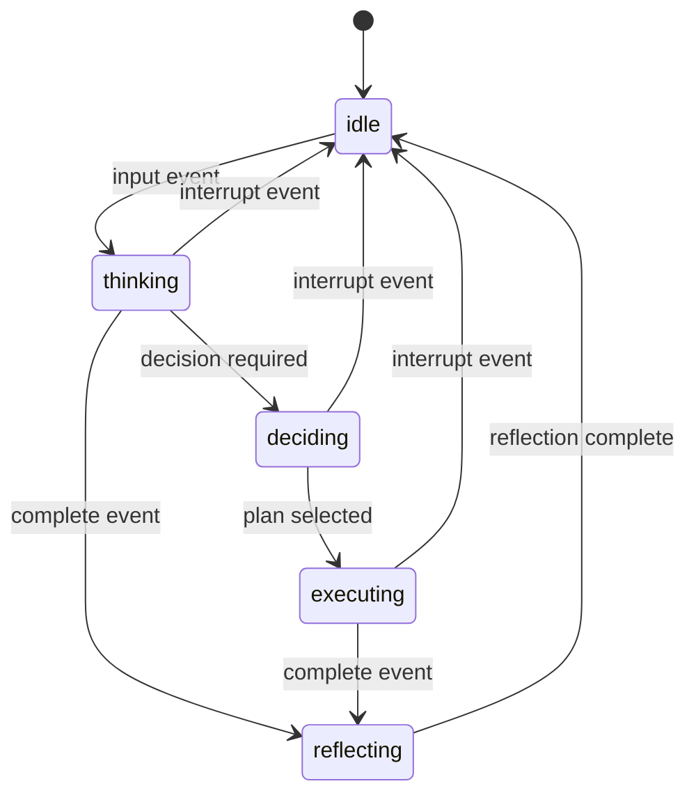
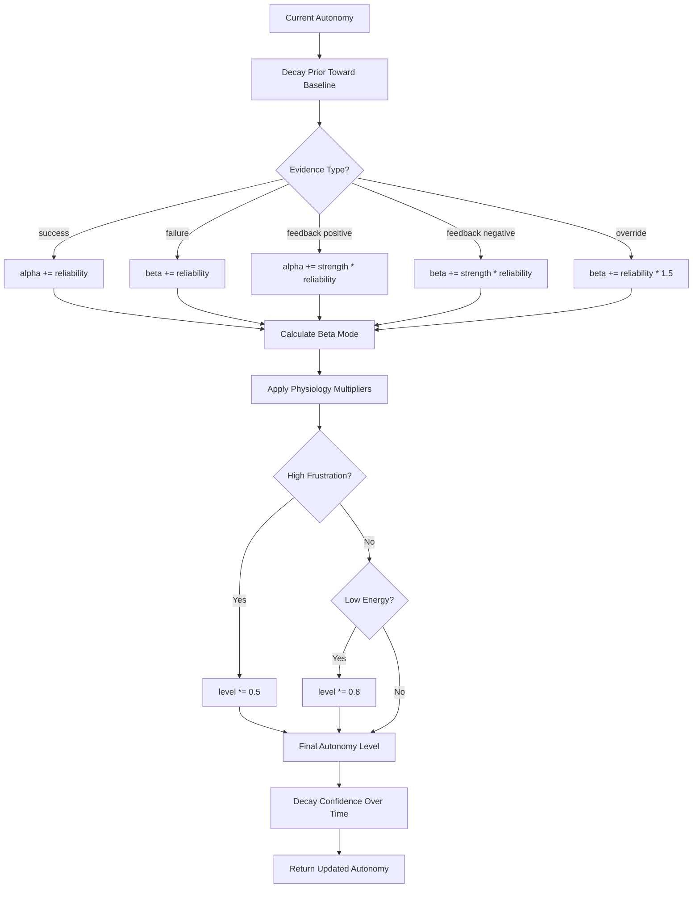
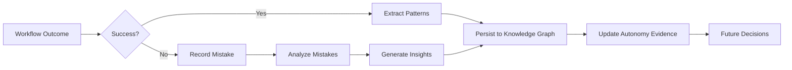
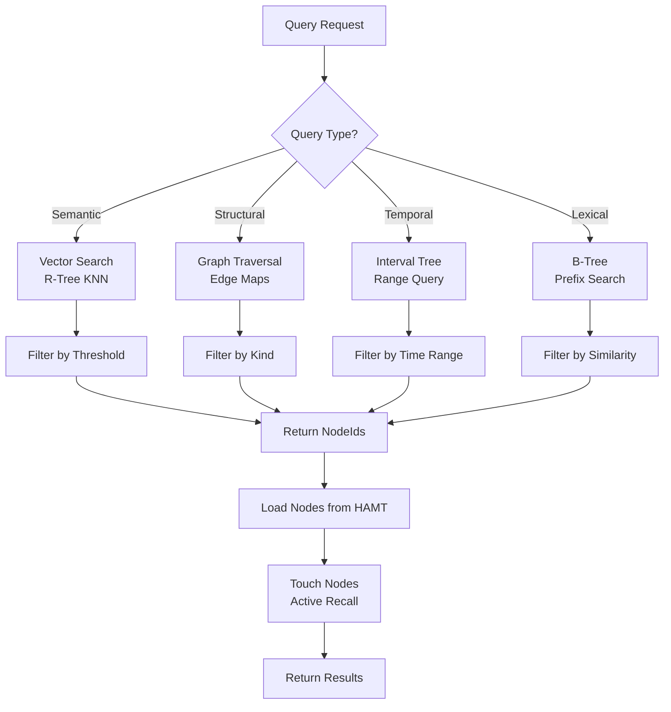
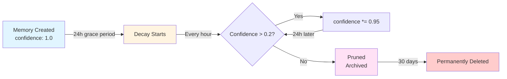
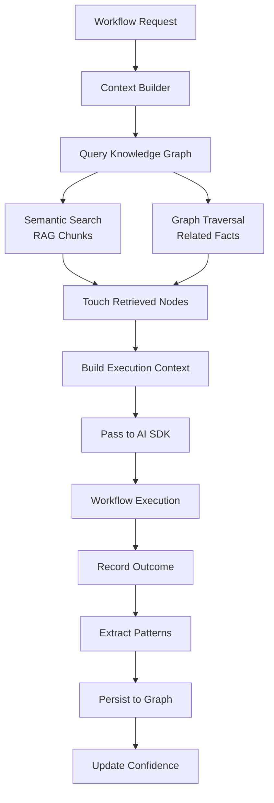
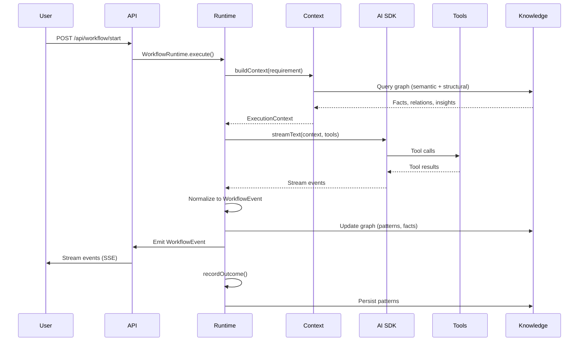

# ALFRED Cognitive Architecture Report

**For:** Senior Architect Onboarding  
**Date:** 2025-01-27  
**Version:** 1.0

---

## Table of Contents

1. [Executive Summary](#1-executive-summary)
2. [Cognitive Architecture Deep Dive](#2-cognitive-architecture-deep-dive)
3. [Learning System Architecture](#3-learning-system-architecture)
4. [Memory System Architecture](#4-memory-system-architecture)
5. [Runtime Architecture](#5-runtime-architecture)
6. [Frontend Integration](#6-frontend-integration)
7. [Notable Code Patterns](#7-notable-code-patterns)
8. [Key Architecture Decisions](#8-key-architecture-decisions)
9. [Integration Points](#9-integration-points)
10. [Performance Characteristics](#10-performance-characteristics)
11. [Testing Strategy](#11-testing-strategy)

---

## 1. Executive Summary

### What ALFRED Is

**ALFRED** is a personal AI assistant with a sophisticated cognitive architecture that fundamentally differs from standard chatbots. Unlike stateless conversational interfaces, ALFRED implements an **event-sourced cognitive state machine** that learns, remembers, forgets, and operates autonomously based on Bayesian probability models and physiological regulation.

### Core Differentiators

1. **Event-Sourced Cognitive State**: All cognitive state changes are driven by typed events (`input`, `timeout`, `feedback`, `interrupt`, `complete`) persisted to `cognitive_events` table. State is reconstructed deterministically from snapshots + event replay.

2. **Hypergraph Memory**: Knowledge is stored as a hypergraph (facts, relations, insights, patterns) with HAMT content addressing, not just a vector database. Relations matter as much as facts, enabling structural queries alongside semantic search.

3. **Bayesian Autonomy**: Autonomy levels use Beta priors (`alpha`, `beta`) that update with reliability-weighted evidence. Autonomy decays over time without reinforcement, and physiology (energy/boredom/frustration) acts as homeostatic regulators.

4. **Self-Supervision**: ALFRED learns from prediction errors without explicit user feedback. The learning system extracts patterns from successful workflows and records mistakes in a ledger that informs future decisions.

5. **Memory Decay**: Confidence-based forgetting prevents unbounded growth. Memories decay exponentially over time, but active recall (touching nodes on retrieval) reinforces frequently accessed knowledge.

### Architecture Philosophy

- **Pure Functions at Core**: Domain logic (`packages/cognitive/`, `packages/knowledge/`, `packages/learning/`) is pure—no side effects, deterministic outputs. Side effects belong at boundaries (routers, repos, schedulers).

- **Performance Budgets**: Hot paths must meet strict budgets (<100µs transitions, <1ms queries, <10ms RAG, <100ms plan generation). Budget violations are defects tracked via Prometheus metrics.

- **Single-User Focus**: Designed for deep personalization of a single user's infrastructure, preferences, and workflows. No multi-tenancy overhead enables aggressive learning and direct infrastructure access.

- **Type Safety**: Branded types (`Timestamp`, `Confidence`, `Autonomy`) prevent mixing, discriminated unions for state machine states, zero `any` types (except JSONB `as any` pattern).

### Key Architectural Decisions

1. **Hypergraph over Vector-Only**: Relations enable structural queries, pattern recognition, and hybrid search. See [Section 8.1](#81-why-hypergraph-over-vector-only).

2. **Event Sourcing**: Deterministic replay, audit trail, temporal queries. See [Section 8.2](#82-why-event-sourcing).

3. **Bayesian Autonomy**: Probabilistic reasoning matches real-world uncertainty. See [Section 8.3](#83-why-bayesian-autonomy).

4. **Pure Functions at Core**: Performance, testability, composability. See [Section 8.5](#85-why-pure-functions-at-core).

---

## 2. Cognitive Architecture Deep Dive

### 2.1 State Machine Design

ALFRED's cognitive system uses an **event-sourced state machine** with pure state transitions. The state machine holds exactly one discriminated union at any time.

#### State Types

```typescript
// packages/cognitive/src/state.ts:134-175
export type CognitiveState =
  | { _: "idle"; since: Timestamp; physiology: Physiology }
  | {
      _: "capturing";
      input: string;
      confidence: Confidence;
      started: Timestamp;
      physiology: Physiology;
    }
  | {
      _: "thinking";
      about: string;
      depth: number;
      paths: Path[];
      reasoningTraces?: string[];
      started: Timestamp;
      physiology: Physiology;
    }
  | {
      _: "deciding";
      options: Decision[];
      criteria: Criteria;
      weights: number[];
      deadline: Timestamp;
      physiology: Physiology;
    }
  | {
      _: "executing";
      plan: Plan;
      step: number;
      auto: AutonomyGradient;
      started: Timestamp;
      physiology: Physiology;
    }
  | {
      _: "reflecting";
      outcome: Outcome;
      expected: string;
      actual: string;
      error: number;
      physiology: Physiology;
    };
```

**Key Design Points:**

- **Discriminated Union**: The `_` field ensures type safety—TypeScript narrows types based on the discriminant.
- **Physiology in Every State**: All states carry `physiology` (energy, boredom, frustration) for homeostatic regulation.
- **Timestamps**: Branded `Timestamp` type prevents mixing with raw numbers.

#### State Transition Graph



**Valid Transitions:**

- `idle` → `thinking` (on `input` event)
- `thinking` → `reflecting` (on `complete` event)
- `thinking` → `deciding` (when decision required)
- `deciding` → `executing` (when plan selected)
- `executing` → `reflecting` (on `complete` event)
- `reflecting` → `idle` (after reflection)
- Any state → `idle` (on `interrupt` event)

#### Pure Transitions

```typescript
// packages/cognitive/src/transition.ts:43-127
export const applyTransition = (
  state: CognitiveState,
  autonomy: AutonomyGradient,
  event: Event
): TransitionResult => {
  const start = performance.now();
  // ... transition logic ...
  // Budget: <100µs enforced via metrics
};
```

**Performance Budget**: <100µs per transition (enforced with `cognitiveTransitionDuration` histogram). Transitions are pure functions—no side effects, deterministic outputs.

**Event Types:**

```typescript
// packages/cognitive/src/state.ts:188-198
export type Event =
  | {
      _: "input";
      content: string;
      source: "user" | "system" | "tool";
      ts: Timestamp;
    }
  | { _: "timeout"; deadline: Timestamp }
  | { _: "feedback"; expected: string; actual: string; ts: Timestamp }
  | { _: "interrupt"; reason: string; priority: 1 | 2 | 3; ts: Timestamp }
  | { _: "complete"; outcome: Outcome; ts: Timestamp };
```

### 2.2 Physiology System

**Physiology** acts as a homeostatic regulator on autonomy levels. Three metrics track cognitive state:

```typescript
// packages/cognitive/src/state.ts:119-124
export type Physiology = {
  energy: number; // 0..1 (decreases with steps)
  boredom: number; // 0..1 (increases with repetition)
  frustration: number; // 0..1 (increases with errors)
};
```

#### Physiology Updates

```typescript
// packages/cognitive/src/state.ts:305-352
export const updatePhysiology = (
  current: Physiology,
  event: "step" | "success" | "error" | "entropy_high" | "entropy_low"
): Physiology => {
  switch (event) {
    case "step":
      energy -= 0.01;
      break;
    case "success":
      frustration *= 0.5;
      energy += 0.05;
      boredom *= 0.9;
      break;
    case "error":
      frustration += 0.2;
      energy -= 0.05;
      break;
    case "entropy_high": // Repetitive loop
      boredom += 0.3;
      break;
    case "entropy_low": // Novelty
      boredom *= 0.8;
      break;
  }
  return {
    energy: clamp01(energy),
    boredom: clamp01(boredom),
    frustration: clamp01(frustration),
  };
};
```

**Physiology → Autonomy Regulation:**

- High frustration (>0.7) → autonomy reduced by 50% multiplier
- Low energy (<0.2) → autonomy reduced by 20% multiplier
- High boredom (>0.9) → constraint violation (prevents loops)

**Key File**: `packages/cognitive/src/state.ts:305-352`

### 2.3 Autonomy Gradient

**Autonomy** determines how independently ALFRED can act. It uses a **Bayesian Beta prior** that updates with evidence.

#### Autonomy Bands

```typescript
// Autonomy bands (from .ruler/11-cognitive-architecture.md)
// Read-only: 0.0-0.3
// Suggest: 0.3-0.5
// Cautious execute: 0.5-0.7
// Supervised execute: 0.7-0.9
// Full: 0.9-1.0
```

#### Beta Prior Structure

```typescript
// packages/cognitive/src/state.ts:69-72, 177-185
type BetaPrior = {
  alpha: number; // Success count (weighted)
  beta: number; // Failure count (weighted)
};

export type AutonomyGradient = {
  level: Autonomy; // Derived from Beta mode
  confidence: Confidence; // 1 - Beta variance
  prior: BetaPrior; // Alpha/beta parameters
  evidence: Evidence[]; // Recent evidence (last 10)
  constraints: Constraint[]; // Temporal, scope, confidence, approval
  lastUpdate: Timestamp;
};
```

#### Evidence Types

```typescript
// packages/cognitive/src/state.ts:50-60
type Evidence =
  | { _: "success"; task: string; duration: number; reliability?: number }
  | { _: "failure"; task: string; error: string; reliability?: number }
  | { _: "feedback"; positive: boolean; strength: number; reliability?: number }
  | { _: "override"; reason: string; reliability?: number };
```

**Reliability Weighting**: Evidence with `reliability=0` is ignored (no-op). Evidence with `reliability<1` is weighted proportionally.

#### Autonomy Update Flow



**Key Algorithm**: `packages/cognitive/src/state.ts:373-455` (`updateAutonomy`)

**Decay Mechanism**: Confidence decays exponentially: `confidence *= 0.95^(days_since_update)`. The Beta prior also decays toward baseline (`alpha=2, beta=5`) over time.

**Reliability Clamp**: If `reliability <= 0`, the update is a no-op (both autonomy level and Beta prior unchanged).

### 2.4 Brainstem Supervisor

The **Brainstem Supervisor** monitors semantic entropy and process heartbeats to detect loops and zombie processes.

#### Loop Detection

```typescript
// packages/cognitive/src/transition.ts:11, 27-32
const entropyKeywords = ["loop", "boredom"];

if (event._ === "interrupt") {
  const reason = event.reason;
  if (entropyKeywords.some((keyword) => reason.includes(keyword))) {
    return updatePhysiology(physiology, "entropy_high");
  }
}
```

**Entropy Events**: Low entropy (repetitive patterns) triggers `entropy_high` → increases boredom → reduces autonomy.

**Key File**: `packages/cognitive/src/flows.ts` (Supervisor logic)

#### Zombie Detection

The supervisor monitors heartbeats. Missing heartbeats trigger `interrupt` events, forcing state transitions.

**Integration**: `packages/runtime/src/core.ts` (WorkflowRuntime supervisor)

### 2.5 Cognitive Loop Integration

The **cognitive loop** (`runCognitiveLoop`) orchestrates state transitions, event persistence, and effect emission.

#### Cognitive Loop Sequence

```mermaid
sequenceDiagram
    participant User
    participant API
    participant Loop
    participant Repo
    participant State

    User->>API: Input Event
    API->>Loop: runCognitiveLoop(ctx, streamId, event)
    Loop->>Repo: getAllEvents(streamId)
    Repo-->>Loop: Historical Events
    Loop->>State: Replay Events (applyTransition)
    State-->>Loop: Current State + Autonomy
    Loop->>State: Apply New Event (applyTransition)
    State-->>Loop: New State + Autonomy
    alt Feedback Event
        Loop->>State: updateAutonomy(evidence, physiology)
        State-->>Loop: Updated Autonomy
    end
    Loop->>Repo: appendEvent(streamId, event)
    Loop->>Loop: computeEffects(newState)
    Loop-->>API: { state, effects }
    API->>User: Handle Effects (generate_response, etc.)
```

**Key Implementation**: `packages/runtime/src/loops/cognitive.ts:42-114`

**Flow Steps:**

1. **Load State**: Replay all historical events to reconstruct current state
2. **Apply Transition**: Pure function `applyTransition(state, autonomy, event)` → new state
3. **Update Autonomy**: If feedback event, update autonomy with evidence
4. **Persist Event**: Store event envelope in `cognitive_events` table
5. **Compute Effects**: Generate side effects (`generate_response`, `execute_plan`, `log_reflection`)
6. **Return**: State + effects for caller to execute

**Event Persistence**: Events are wrapped in envelopes with `id`, `type`, `resource`, `createdAt`, `data`:

```typescript
// packages/runtime/src/loops/cognitive.ts:92-109
const envelope = wrapEventEnvelope({
  id: crypto.randomUUID(),
  type: incomingEvent._,
  resource: "user",
  data: incomingEvent,
});
await cognitiveRepo.appendEvent(streamId, incomingEvent._, envelope);
```

**Effect Handling**: Effects are returned to the caller (API router) for execution. The cognitive loop never executes side effects directly—maintains purity.

---

## 3. Learning System Architecture

ALFRED implements both **explicit** (user feedback) and **implicit** (outcome observation) learning mechanisms.

### 3.1 Self-Supervision

**Self-supervision** learns from prediction errors without explicit user feedback.

#### Supervision Function

```typescript
// packages/learning/src/self_supervision.ts:19-41
export function supervise(event: SupervisionEvent): KnowledgeUpdate[] | null {
  if (!Number.isFinite(event.error) || event.error <= 0) {
    return null;
  }

  const insight: KnowledgeInsight = {
    id: `insight-${Date.now().toString(36)}`,
    derived: [],
    conclusion: "Prediction error detected",
    confidence: confidence(Math.max(0.1, 1 - clamp(event.error))),
    rationale: `Observed difference between expected and actual output at ${event.ts}.`,
  };

  return [{ node: insight, replace: false }];
}
```

**Key Pattern**: Pure function that takes a supervision event and returns knowledge updates. No side effects—caller persists updates.

**Error Calculation**: Error is normalized to [0,1]. Confidence is `1 - error` (higher error → lower confidence).

**Integration**: Called after workflow completion when `expected !== actual`. Updates feed into knowledge graph.

### 3.2 Mistake Analysis

**Mistake ledger** records failures and analyzes patterns.

#### Mistake Recording

```typescript
// packages/learning/src/mistake_ledger.ts:6-22
export type MistakeEntry = {
  id: string;
  cause: string;
  effect: string;
  category: string;
  context?: Record<string, unknown>;
  ts: string;
};

const ledger: MistakeEntry[] = [];

export function recordMistake(entry: MistakeEntry): void {
  ledger.push({ ...entry });
}
```

#### Mistake Analysis

```typescript
// packages/learning/src/mistake_ledger.ts:24-54
export function analyzeMistakes(
  entries: MistakeEntry[] = ledger
): KnowledgeInsight[] {
  const grouped = new Map<string, MistakeEntry[]>();
  for (const entry of entries) {
    const key = entry.category ?? "uncategorized";
    if (!grouped.has(key)) {
      grouped.set(key, []);
    }
    grouped.get(key)?.push(entry);
  }

  const insights: KnowledgeInsight[] = [];
  for (const [category, items] of grouped.entries()) {
    insights.push({
      id: `mistake-${category}-${items.length}`,
      derived: items.map((item) => item.id),
      conclusion: `Observed ${items.length} issue(s) in ${category}.`,
      confidence: confidence(
        Math.min(1, items.length / Math.max(entries.length, 1))
      ),
      rationale: `Recent mistakes indicate focus area: ${category}.`,
    });
  }
  return insights;
}
```

**Pattern**: Groups mistakes by category, generates insights with confidence based on frequency. Insights feed into knowledge graph and inform autonomy updates.

### 3.3 Explicit Learning

**User feedback** provides direct learning signals.

#### Feedback Endpoint

```typescript
// packages/api/src/routers/cognitive.ts:42-72
export const cognitiveRouter = router({
  feedback: authedProcedure
    .use(requirePolicy("cognitive.feedback", mapResource, buildContext))
    .input(feedbackInput)
    .mutation(async ({ ctx, input }) => {
      const event: Event = {
        _: "feedback",
        expected: input.expected,
        actual: input.actual ?? "",
        ts: (input.ts ?? Date.now()) as any,
      };

      const { state, effects } = await runCognitiveLoop(
        ctx.runtimeContext,
        input.streamId,
        event
      );

      // Effects handled separately
      await handleCognitiveEffects(ctx.runtimeContext, input.streamId, effects);

      return { state, obligations: ctx.policy?.obligations ?? [] };
    }),
});
```

**Flow**: User submits feedback → `runCognitiveLoop` with `feedback` event → autonomy updated with evidence → effects handled.

**Evidence Calculation**: `packages/runtime/src/loops/cognitive.ts:116-129`

```typescript
function calculateEvidence(event: Event & { _: "feedback" }) {
  const positive = event.expected === event.actual;
  return {
    _: "feedback",
    positive,
    strength: 0.5, // Default strength
  } as const;
}
```

### 3.4 Implicit Learning

**Outcome observation** learns from workflow results without explicit feedback.

#### Pattern Extraction

Successful workflows become reusable patterns:

```typescript
// packages/cognitive/src/flows.ts:209-335 (synthesize function)
export async function synthesize(
  facts: KnowledgeFact[],
  graph: Hypergraph
): Promise<SynthesisResult> {
  // ... extracts relations, contradictions, entity clusters ...
  // Successful patterns become graph edges
}
```

**Integration**: After workflow completion, `CoreRuntime.recordOutcome()` extracts patterns and persists them to the knowledge graph.

#### Confidence Scoring

Learning confidence is calculated from:

- Pattern frequency (more examples → higher confidence)
- Outcome success rate (successful patterns → higher confidence)
- Recency (recent patterns → higher confidence)

**Key File**: `packages/runtime/src/core.ts` (outcome recording)

### 3.5 Learning Integration

**Learning feeds into knowledge and cognitive systems:**



**Key Integration Points:**

- `packages/runtime/src/core.ts`: `recordOutcome()` extracts patterns
- `packages/learning/src/self_supervision.ts`: Converts errors to insights
- `packages/cognitive/src/state.ts`: Autonomy updates use learning evidence

---

## 4. Memory System Architecture

ALFRED's memory system uses a **hypergraph** structure with active recall reinforcement and confidence-based decay.

### 4.1 Hypergraph Structure

#### Node Types

```typescript
// packages/knowledge/src/hypergraph.ts:19-34
export type Knowledge =
  | {
      _: "fact";
      content: string;
      confidence: Confidence;
      source: string;
      ts: Timestamp;
    }
  | { _: "relation"; from: NodeId; to: NodeId; kind: string; weight: number }
  | {
      _: "insight";
      derived: NodeId[];
      conclusion: string;
      confidence: Confidence;
    }
  | { _: "pattern"; examples: NodeId[]; rule: string; accuracy: number };
```

**Key Design:**

- **Facts**: Atomic knowledge units with confidence and source
- **Relations**: Connections between nodes with weights
- **Insights**: Derived knowledge from multiple facts
- **Patterns**: Reusable rules extracted from examples

#### HAMT Content Addressing

```typescript
// packages/knowledge/src/hypergraph.ts:89-123
class HAMT<V> {
  private readonly root = new Map<number, Map<string, V>>();

  set(key: string, value: V): void {
    const hash = this.hash(key);
    const bucket = hash & 0xff;
    if (!this.root.has(bucket)) {
      this.root.set(bucket, new Map());
    }
    this.root.get(bucket)?.set(key, value);
  }
}
```

**Content Addressing**: Nodes are addressed by content hash (`knowledgeHash`), enabling O(1) deduplication. Identical content maps to the same node.

#### Hypergraph Structure Diagram

```mermaid
graph TB
    subgraph "Node Types"
        F1[Fact: "User prefers dark mode"]
        F2[Fact: "User uses TypeScript"]
        I1[Insight: "Prefers typed languages"]
        R1[Relation: semantically_similar]
        R2[Relation: lexical_match]
        P1[Pattern: "Use TypeScript for new projects"]
    end

    F1 -->|R1| F2
    F1 -->|derived| I1
    F2 -->|derived| I1
    I1 -->|examples| P1
    F1 -->|R2| F2

    style F1 fill:#e1f5ff
    style F2 fill:#e1f5ff
    style I1 fill:#fff4e1
    style P1 fill:#ffe1f5
```

### 4.2 Storage and Retrieval

#### Indices

The hypergraph maintains multiple indices for different query types:

```typescript
// packages/knowledge/src/hypergraph.ts:126-139
export class Hypergraph {
  private readonly nodes = new HAMT<Knowledge>();
  private readonly temporal = new IntervalTree(); // Temporal queries
  private readonly spatial = new RTreeND(1024); // Vector similarity
  private readonly ordered = new BTreeIndex<string, NodeId>(64); // Lexical search
  private readonly edges = new Map<NodeId, Set<NodeId>>(); // Graph traversal
  private readonly inbound = new Map<NodeId, Set<NodeId>>(); // Reverse traversal
  private readonly edgesByKind = new Map<string, Map<NodeId, Set<NodeId>>>(); // Filtered traversal
}
```

**Index Selection:**

- **HAMT**: O(1) content-addressable lookups
- **Interval Tree**: Temporal range queries (`between(start, end)`)
- **R-Tree**: Vector similarity search (KNN queries)
- **B-Tree**: Lexical search (`search(pattern)`)
- **Edge Maps**: Graph traversal (`neighbors(id)`, `predecessors(id)`)

#### Query Flow



**Performance Budgets:**

- Graph lookups: <1ms
- Fact extraction: <10ms
- Hybrid queries: <50ms

**Key Files:**

- `packages/knowledge/src/query.hot.ts`: Hot-path query engine
- `packages/knowledge/src/hypergraph.ts`: Core hypergraph implementation

### 4.3 Active Recall Reinforcement

**Active recall** strengthens memories when accessed.

#### Touch Mechanism

```typescript
// packages/db/src/repo/graph/write.ts (conceptual)
export async function touchNode(nodeId: string): Promise<void> {
  await db
    .update(memoryNodes)
    .set({
      updated: sql`NOW()`, // Reset decay timer
      properties: sql`jsonb_set(
        COALESCE(properties, '{}'::jsonb),
        '{confidence}',
        to_jsonb(LEAST(1.0, (properties->>'confidence')::float + 0.05))
      )`,
    })
    .where(eq(memoryNodes.id, nodeId));
}
```

**Reinforcement Rules:**

- **Touch on Retrieval**: When a node is retrieved via semantic search or graph traversal, it's "touched"
- **Confidence Boost**: Confidence increases by `0.05` (capped at `1.0`)
- **Decay Timer Reset**: `updated_at` timestamp updated → resets decay timer

**Integration**: `packages/knowledge/src/query.hot.ts` touches nodes after retrieval.

### 4.4 Memory Decay

**Memory decay** prevents unbounded growth by reducing confidence over time.

#### Decay Model

```typescript
// Conceptual decay algorithm (from docs/architecture/memory-system.md)
// 1. Find nodes not updated within MEMORY_DECAY_THRESHOLD_MS (default: 24h)
// 2. Multiply confidence by MEMORY_DECAY_FACTOR (default: 0.95)
// 3. Apply confidence floor (minimum: 0.01)
// 4. Prune nodes below MEMORY_PRUNE_CONFIDENCE (default: 0.2)
```

**Decay Timeline:**



**Safety Rails:**

- **Decay Limit**: Maximum 1000 nodes decayed per cycle (prevents runaway operations)
- **Confidence Floor**: Minimum `0.01` (prevents complete forgetting unless pruned)
- **Circuit Breaker**: Errors don't crash the API server

**Key Implementation**: `packages/agent/src/orchestrator/learning-worker.ts` (memory maintenance loop)

**Metrics**: `memoryNodesDecayedTotal`, `memoryNodesPrunedTotal`, `memoryNodesCleanedTotal`

### 4.5 Memory Integration

**Memory feeds into context building and cognitive state:**



**Key Integration Points:**

- `packages/runtime/src/context.ts`: Context building queries knowledge graph
- `packages/runtime/src/core.ts`: Outcome recording persists patterns
- `packages/knowledge/src/persist.ts`: Persistence layer

---

## 5. Runtime Architecture

The **runtime layer** (`packages/runtime/`) orchestrates cognitive, knowledge, and learning packages into cohesive execution.

### 5.1 Runtime Layer Purpose

**Separation of Concerns:**

- **Domain Packages**: Pure logic (`cognitive/`, `knowledge/`, `learning/`)
- **Runtime Layer**: Orchestration, context building, workflow execution
- **API Layer**: HTTP/tRPC boundaries, persistence, metrics

**Key Principle**: Runtime composes domain packages without tight coupling. Domain packages remain pure and testable in isolation.

### 5.2 Workflow Execution

#### Workflow Execution Flow



**Key Implementation**: `packages/runtime/src/core.ts` (WorkflowRuntime)

#### AI SDK v6 Integration

```typescript
// Conceptual integration (from packages/runtime/src/workflow/executor.ts)
const result = await streamText({
  model: ctx.aiModel,
  messages: buildMessages(context),
  tools: orchestratorTools,
  system: buildSystemPrompt(context),
});

for await (const chunk of result.textStream) {
  // Normalize to WorkflowEvent
  emit({ type: "text", text: chunk });
}
```

**Event Normalization**: AI SDK events (`text`, `tool-call`, `tool-result`) are normalized to `WorkflowEvent` discriminated unions.

### 5.3 Context Building

**Context building** assembles multi-domain context before execution.

#### Context Sources

```typescript
// packages/runtime/src/context.ts:94-215
async build(input: ContextBuildInput): Promise<ExecutionContext> {
  // 1. User Preferences (from DB)
  const preferences = await db.query.preferences(userId);

  // 2. Knowledge Graph (semantic + structural)
  const knowledgeContext = await knowledgeEngine.query({
    semantic: { query: input.requirement, topK: 5 },
    structural: { fromNode: relatedNodeId, depth: 2 },
  });

  // 3. Cognitive State (current state machine state)
  const cognitiveState = await cognitiveRepo.getCurrentState(streamId);

  // 4. Learnings (patterns, mistakes)
  const learnings = await learningEngine.getPatterns({
    domain: input.workspace,
    minConfidence: 0.8,
  });

  // 5. RAG Chunks (semantic search)
  const ragChunks = await ragEngine.retrieve(input.requirement, { topK: 5 });

  return {
    requirement: input.requirement,
    receipts: searchReceipts,
    bundle: contextBundle,
    totalTokens: estimateTokens(context),
    ragChunks,
    ragDocumentIds: ragChunks.map(c => c.documentId),
  };
}
```

**Caching**: Context is cached with 5-minute TTL. Cache key includes requirement hash + workspace + user ID.

**Key File**: `packages/runtime/src/context.ts`

### 5.4 Outcome Recording

**Outcome recording** feeds successful patterns into the learning system.

```typescript
// packages/runtime/src/core.ts (conceptual)
async recordOutcome(runId: string, outcome: Outcome): Promise<void> {
  if (outcome._ === "success") {
    // Extract patterns from successful workflow
    const patterns = extractPatterns(runId);

    // Persist to knowledge graph
    await knowledgeEngine.persistPatterns(patterns);

    // Update autonomy with success evidence
    await updateAutonomyEvidence({
      _: "success",
      task: runId,
      duration: outcome.duration,
      reliability: 1.0,
    });
  } else if (outcome._ === "failure") {
    // Record mistake
    await recordMistake({
      id: runId,
      cause: outcome.error,
      effect: "workflow_failed",
      category: "execution",
    });

    // Update autonomy with failure evidence
    await updateAutonomyEvidence({
      _: "failure",
      task: runId,
      error: outcome.error,
      reliability: 1.0,
    });
  }
}
```

**Integration**: Called after workflow completion. Patterns become graph edges, mistakes inform future decisions.

---

## 6. Frontend Integration

The frontend integrates with ALFRED's cognitive and workflow systems via **streaming architecture** and **real-time UI updates**.

### 6.1 Streaming Architecture

#### AI SDK v6 Hooks

```typescript
// apps/web/src/hooks/use-assistant-stream.ts:99-166
export function useAssistantStream(options?: AssistantStreamOptions) {
  const chat = useChat({
    api: "/api/assistant",
    streamProtocol: "data",
    onFinish: (message) => {
      // Handle completion
    },
    onError: (error) => {
      // Handle errors
    },
  });

  return {
    messages: chat.messages,
    send: chat.append,
    isLoading: chat.isLoading,
    error: chat.error,
  };
}
```

**Stream Protocol**: Uses AI SDK v6's `data` stream protocol. Events are typed `StreamEvent` discriminated unions.

#### Event Types

```typescript
// packages/type/src/stream.ts (conceptual)
export type StreamEvent =
  | { type: "text"; text: string }
  | { type: "reasoning"; text: string; state: string }
  | { type: "tool-call"; toolCallId: string; toolName: string; input: unknown }
  | {
      type: "tool-result";
      toolCallId: string;
      toolName: string;
      output: unknown;
    }
  | { type: "data-cache"; operation: "hit" | "miss"; key: string }
  | { type: "error"; error: string };
```

**Key Pattern**: Discriminated unions enable type-safe event handling.

### 6.2 Cognitive State Visualization

**Mindscape** visualizes knowledge graph and cognitive state.

#### Mindscape Integration

```typescript
// apps/web/src/components/mindscape/nodes/chat-node.tsx (conceptual)
export function ChatNode({ nodeId }: { nodeId: string }) {
  const { messages, send } = useChatLogic({ initialAgent: "assistant" });

  // Visualize cognitive state
  const cognitiveState = useCognitiveState(nodeId);

  return (
    <OrbNode
      state={cognitiveState._}
      physiology={cognitiveState.physiology}
      autonomy={cognitiveState.auto?.level}
    />
  );
}
```

**Visualization**: Nodes show cognitive state (`idle`, `thinking`, `executing`), physiology metrics (energy, boredom, frustration), and autonomy level.

**Key File**: `apps/web/src/routes/mindscape.tsx`

### 6.3 State Synchronization

**Optimistic updates** handle streaming updates without blocking UI.

```typescript
// apps/web/src/components/chat-container.tsx (conceptual)
export function ChatContainer() {
  const { messages, send, isLoading } = useAssistantStream();

  // Optimistic update: Add user message immediately
  const handleSend = (text: string) => {
    const optimisticMessage = { id: crypto.randomUUID(), role: "user", parts: [{ type: "text", text }] };
    setMessages(prev => [...prev, optimisticMessage]);

    // Stream response
    send(text);
  };

  // Error handling: Show retry affordance
  if (error) {
    return <ErrorBoundary error={error} onRetry={() => send(lastMessage)} />;
  }

  return <Chat messages={messages} onSend={handleSend} />;
}
```

**Error Boundaries**: Route-level error boundaries catch streaming errors and provide retry mechanisms.

**Key File**: `apps/web/src/components/chat-container.tsx`

---

## 7. Notable Code Patterns

### 7.1 Pure Function Pattern

**Core Principle**: Domain logic is pure (no side effects), boundaries handle I/O.

**Example:**

```typescript
// packages/cognitive/src/transition.ts:43-127
export const applyTransition = (
  state: CognitiveState,
  autonomy: AutonomyGradient,
  event: Event
): TransitionResult => {
  // Pure function: no side effects, deterministic output
  // Side effects (persistence, metrics) handled by caller
  return { state: newState, autonomy: newAutonomy };
};
```

**Benefits:**

- **Testability**: Pure functions are easy to test (no mocks needed)
- **Performance**: No I/O overhead in hot paths
- **Determinism**: Same inputs → same outputs (enables replay)

**Boundary Pattern**: Routers, repos, schedulers handle side effects:

```typescript
// packages/api/src/routers/cognitive.ts:57-63
const { state, effects } = await runCognitiveLoop(ctx, streamId, event);
// runCognitiveLoop is pure, but caller handles persistence
await handleCognitiveEffects(ctx, streamId, effects);
```

### 7.2 Event Sourcing Pattern

**Implementation**: All state changes via events, deterministic replay.

```typescript
// packages/runtime/src/loops/cognitive.ts:52-69
const events = await cognitiveRepo.getAllEvents(streamId);
let state: CognitiveState = idle(Date.now());
let autonomy = createInitialAutonomy();

// Replay history deterministically
for (const record of events) {
  const historicalEvent = unwrapEventEnvelope(record.payload).data as Event;
  const result = applyTransition(state, autonomy, historicalEvent);
  state = result.state;
  autonomy = result.autonomy;
}
```

**Benefits:**

- **Audit Trail**: Complete history of state changes
- **Temporal Queries**: Query state at any point in time
- **Debugging**: Replay events to reproduce bugs

**Persistence**: Events stored in `cognitive_events` table with snapshots for fast hydration.

### 7.3 Performance Budget Pattern

**Enforcement**: Metrics track budget violations.

```typescript
// packages/cognitive/src/transition.ts:106-126
const durationMs = performance.now() - start;
cognitiveTransitionDuration.observe(
  {
    from_state: state._,
    to_state: toState,
    event_type: event._,
  },
  durationMs / 1000
);

if (shouldWarn && durationMs > 0.1) {
  console.warn(
    `cognitive_budget_exceeded: transition took ${durationMs.toFixed(4)}ms`
  );
}
```

**Hot Paths**: Files with `.hot.ts` suffix indicate performance-critical code:

- `packages/cognitive/src/transition.ts`
- `packages/knowledge/src/query.hot.ts`

**Budgets:**

- Cognitive transitions: <100µs
- Graph lookups: <1ms
- Fact extraction: <10ms
- Context building: <100ms

### 7.4 Type Safety Pattern

**Branded Types**: Prevent mixing of semantically different numbers.

```typescript
// packages/cognitive/src/state.ts:15-25
type Timestamp = number & { readonly _: unique symbol };
type Confidence = number & {
  readonly _: unique symbol;
  readonly min: 0;
  readonly max: 1;
};
type Autonomy = number & {
  readonly _: unique symbol;
  readonly min: 0;
  readonly max: 1;
};

export const timestamp = (n: number): Timestamp => {
  if (!Number.isFinite(n) || n < 0) throw new Error("Invalid timestamp");
  return n as Timestamp;
};
```

**Discriminated Unions**: State machine states use discriminated unions:

```typescript
export type CognitiveState =
  | { _: "idle"; since: Timestamp; physiology: Physiology }
  | { _: "thinking"; about: string; depth: number; ... };
```

**Zero `any`**: Strict typing throughout (except JSONB `as any` pattern for Drizzle limitation).

### 7.5 Boundary Pattern

**Separation**: Routers/repos/schedulers handle side effects, core stays pure.

```typescript
// Boundary: packages/api/src/routers/cognitive.ts
export const cognitiveRouter = router({
  feedback: authedProcedure.mutation(async ({ ctx, input }) => {
    // Side effects: DB access, metrics, logging
    const { state, effects } = await runCognitiveLoop(ctx, streamId, event);
    await handleCognitiveEffects(ctx, streamId, effects);
    return { state };
  }),
});

// Core: packages/runtime/src/loops/cognitive.ts
export async function runCognitiveLoop(...): Promise<CognitiveLoopResult> {
  // Pure: no side effects, returns data + effects
  return { state: newState, effects };
}
```

**Benefits:**

- **Testability**: Core logic testable without mocks
- **Composability**: Pure functions compose easily
- **Performance**: No I/O in hot paths

---

## 8. Key Architecture Decisions

### 8.1 Why Hypergraph Over Vector-Only?

**Rationale**: Relations matter as much as facts. Structural queries enable pattern recognition and dependency awareness.

**Benefits:**

- **Structural Queries**: Traverse graph to find related concepts
- **Pattern Recognition**: Extract patterns from graph topology
- **Hybrid Search**: Combine semantic (vector) + structural (graph) queries
- **Native to Postgres**: No additional infrastructure (pgvector extension)

**Trade-offs:**

- More complex than pure vector DB
- Requires maintaining multiple indices (HAMT, interval tree, B-tree, R-tree)

**Reference**: `packages/knowledge/src/hypergraph.ts`

### 8.2 Why Event Sourcing?

**Rationale**: Deterministic replay, audit trail, temporal queries.

**Benefits:**

- **Deterministic Replay**: Reconstruct state from events
- **Audit Trail**: Complete history of state changes
- **Temporal Queries**: Query state at any point in time
- **Debugging**: Reproduce bugs by replaying events

**Trade-offs:**

- Storage overhead (events + snapshots)
- Snapshot complexity (when to snapshot, how to hydrate)

**Reference**: `packages/runtime/src/loops/cognitive.ts:52-69`

### 8.3 Why Bayesian Autonomy?

**Rationale**: Probabilistic reasoning matches uncertainty in real-world decisions.

**Benefits:**

- **Confidence Intervals**: Beta variance provides confidence measure
- **Reliability Weighting**: Evidence reliability affects updates
- **Natural Decay**: Beta prior decays toward baseline over time
- **Physiology Integration**: Homeostatic regulation via multipliers

**Trade-offs:**

- More complex than simple counters
- Requires understanding Beta distribution math

**Reference**: `packages/cognitive/src/state.ts:373-455` (`updateAutonomy`)

### 8.4 Why Single-User Focus?

**Rationale**: Enables aggressive personalization, no multi-tenancy overhead.

**Benefits:**

- **Deep Learning**: All data belongs to one person → aggressive learning
- **Direct Infrastructure Access**: No abstraction layers for multi-user
- **Privacy**: Data stays local, no sharing concerns
- **Simplicity**: No rate limiting, obvious defaults

**Trade-offs:**

- Not scalable to multiple users (by design)
- Hardcoded defaults (timeouts, retries, limits)

**Reference**: `.ruler/02-architecture.md` rule 9

### 8.5 Why Pure Functions at Core?

**Rationale**: Performance, testability, composability.

**Benefits:**

- **Performance**: No I/O overhead in hot paths (meets <100µs budgets)
- **Testability**: Pure functions easy to test (no mocks)
- **Composability**: Functions compose easily (no hidden dependencies)
- **Determinism**: Same inputs → same outputs (enables replay)

**Trade-offs:**

- More function parameters (no dependency injection)
- Caller must handle side effects

**Reference**: `.ruler/09-purity-and-performance.md`

---

## 9. Integration Points

### 9.1 Cognitive ↔ Knowledge

**How**: Cognitive state queries knowledge graph for context during workflow execution.

**When**: During context building (`packages/runtime/src/context.ts`), after execution (pattern extraction).

**Key Files:**

- `packages/runtime/src/context.ts`: Context building queries graph
- `packages/runtime/src/core.ts`: Outcome recording persists patterns

**Flow:**

```
Workflow Request → Context Builder → Knowledge Graph Query → Execution Context → AI SDK
```

### 9.2 Learning ↔ Knowledge

**How**: Successful patterns become graph edges, mistakes marked as anti-patterns.

**When**: After outcome recording (`packages/runtime/src/core.ts`).

**Key Files:**

- `packages/learning/src/self_supervision.ts`: Converts errors to insights
- `packages/knowledge/src/hypergraph.ts`: Persists patterns as graph edges

**Flow:**

```
Workflow Outcome → Extract Patterns → Persist to Graph → Future Queries
```

### 9.3 Cognitive ↔ Learning

**How**: Autonomy updates use learning evidence, mistakes affect autonomy.

**When**: During autonomy updates (`packages/cognitive/src/state.ts:373-455`), after mistake detection.

**Key Files:**

- `packages/cognitive/src/state.ts`: Autonomy updates with evidence
- `packages/learning/src/mistake_ledger.ts`: Records mistakes

**Flow:**

```
Mistake Detected → Record Mistake → Analyze Patterns → Update Autonomy Evidence → Future Decisions
```

### 9.4 Runtime ↔ All Domains

**How**: Runtime orchestrates all domain packages.

**When**: During workflow execution, context building, outcome recording.

**Key Files:**

- `packages/runtime/src/core.ts`: WorkflowRuntime orchestrates execution
- `packages/runtime/src/context.ts`: ContextBuilder queries domains
- `packages/runtime/src/engines/`: Domain engines (cognitive, knowledge, learning)

**Flow:**

```
Workflow Request → Runtime → Context Builder → Domain Queries → Execution → Outcome Recording → Domain Updates
```

---

## 10. Performance Characteristics

### 10.1 Budgets

| Operation             | Budget | Enforcement                                      |
| --------------------- | ------ | ------------------------------------------------ |
| Cognitive transitions | <100µs | `cognitiveTransitionDuration` histogram          |
| Graph lookups         | <1ms   | `knowledgeQueryDuration` histogram               |
| Fact extraction       | <10ms  | `knowledgeExtractionDuration` histogram          |
| Context building      | <100ms | `runtimeContextBuildDurationSeconds` histogram   |
| Plan generation       | <100ms | `runtimePlanGenerationDurationSeconds` histogram |

**Key Metrics**: `packages/cognitive/src/metrics.ts`, `packages/knowledge/src/metrics.ts`, `packages/runtime/src/metrics.ts`

### 10.2 Hot Paths

**Files with `.hot.ts` suffix:**

- `packages/cognitive/src/transition.ts` (state transitions)
- `packages/knowledge/src/query.hot.ts` (graph queries)

**Zero-Allocation Patterns:**

- Reuse buffers in hot loops
- Avoid array spreading
- Prefer `for` loops over `map`/`filter`

**Example:**

```typescript
// packages/knowledge/src/hypergraph.ts:298-301
search(pattern: string): NodeId[] {
  // BTree range query (no allocations)
  return this.ordered.range(pattern, `${pattern}\xFF`);
}
```

### 10.3 Metrics

**Prometheus Metrics** (exposed on `/api/metrics`):

- `cognitive_transition_duration_seconds{from_state,to_state,event_type}`
- `cognitive_autonomy_update_duration_seconds`
- `cognitive_physiology_gauge{metric}` (energy, boredom, frustration)
- `knowledge_query_duration_seconds{query_type}`
- `memory_nodes_decayed_total`
- `memory_nodes_pruned_total`
- `runtime_context_build_duration_seconds{cached}`

**Budget Violations**: `cognitive_budget_exceeded` warnings logged when budgets exceeded.

---

## 11. Testing Strategy

### 11.1 Unit Tests

**Pure Functions**: Tested in isolation without mocks.

```typescript
// packages/cognitive/test/state-transitions.test.ts
describe("applyTransition", () => {
  it("transitions idle → thinking on input event", () => {
    const state = idle(Date.now());
    const event: Event = {
      _: "input",
      content: "test",
      source: "user",
      ts: timestamp(Date.now()),
    };
    const result = applyTransition(state, initialAutonomy(Date.now()), event);
    expect(result.state._).toBe("thinking");
  });
});
```

**Deterministic Time**: Tests pass explicit timestamps (no `Date.now()` patching).

**Key Files**: `packages/cognitive/test/*.test.ts`, `packages/knowledge/test/*.test.ts`

### 11.2 Integration Tests

**Runtime Composition**: Test runtime with mocked AI SDK.

```typescript
// packages/runtime/test/cognitive-loop.integration.test.ts
describe("runCognitiveLoop integration", () => {
  it("persists events and replays history", async () => {
    const ctx = createTestRuntimeContext();
    const result1 = await runCognitiveLoop(ctx, streamId, inputEvent("Test"));
    const result2 = await runCognitiveLoop(
      ctx,
      streamId,
      completeEvent(successOutcome)
    );
    // Verify events persisted and state reconstructed
  });
});
```

**Database Operations**: Use test DB with transactions for isolation.

**Key Files**: `packages/runtime/test/*.integration.test.ts`

### 11.3 E2E Tests

**Full Workflow Execution**: Test complete workflows end-to-end.

```typescript
// apps/web/test/*.test.ts (conceptual)
describe("Workflow E2E", () => {
  it("executes workflow and updates knowledge graph", async () => {
    const response = await fetch("/api/workflow/start", {
      method: "POST",
      body: JSON.stringify({ requirement: "test" }),
    });
    // Verify workflow executed, events streamed, knowledge updated
  });
});
```

**Suspend/Resume Flows**: Test workflow suspension and resumption.

**Key Files**: `apps/web/test/*.test.ts`, Playwright E2E tests

---

## Conclusion

ALFRED's cognitive architecture represents a sophisticated approach to AI assistant design, combining event-sourced state machines, Bayesian autonomy, hypergraph memory, and self-supervision into a cohesive system. The architecture prioritizes **purity** (pure functions at core), **performance** (strict budgets), and **personalization** (single-user focus).

**Key Strengths:**

- Deterministic state machine enables replay and debugging
- Bayesian autonomy provides probabilistic reasoning with confidence intervals
- Hypergraph memory enables structural queries alongside semantic search
- Self-supervision learns from outcomes without explicit feedback
- Memory decay prevents unbounded growth while preserving useful knowledge

**Potential Concerns:**

- Event sourcing adds storage overhead (mitigated by snapshots)
- Bayesian math requires understanding Beta distributions
- Single-user focus limits scalability (by design)
- Pure function pattern requires careful boundary management

**Next Steps for Senior Architect:**

1. Review `packages/cognitive/src/state.ts` for state machine implementation
2. Review `packages/knowledge/src/hypergraph.ts` for memory structure
3. Review `packages/runtime/src/loops/cognitive.ts` for cognitive loop integration
4. Review `packages/runtime/src/context.ts` for context building
5. Review `packages/api/src/routers/workflow.ts` for workflow execution

---

**Report Version**: 1.0  
**Last Updated**: 2025-01-27  
**Author**: AI Architecture Analysis
