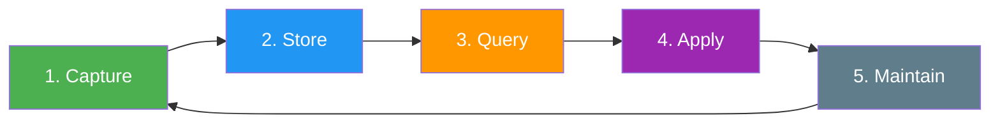
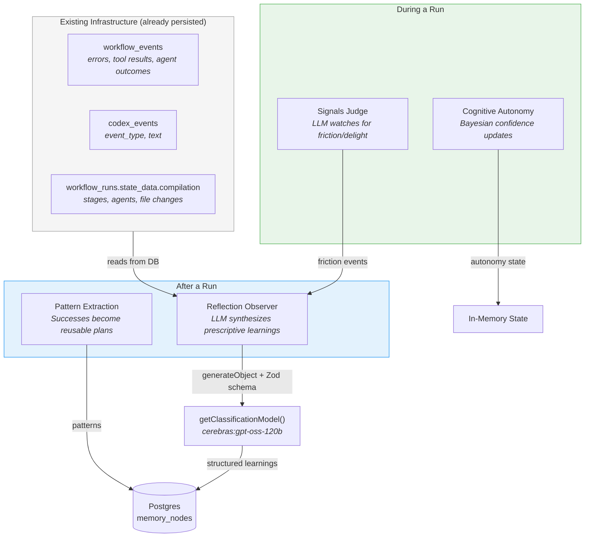
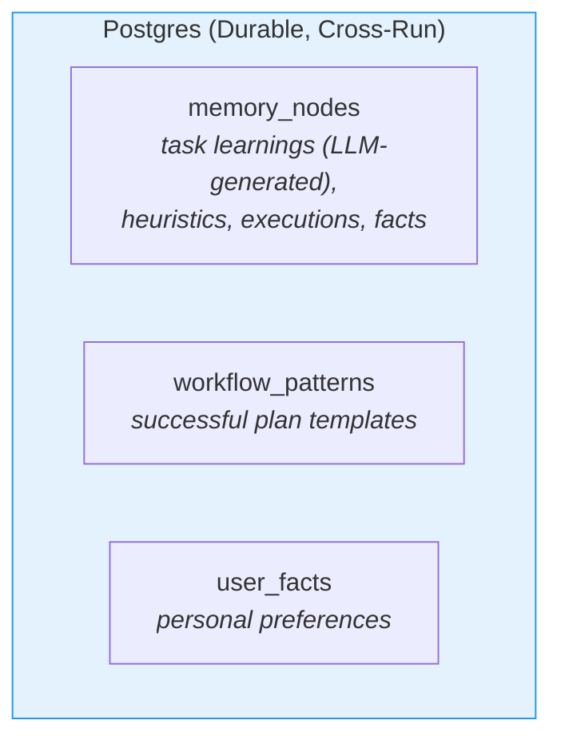
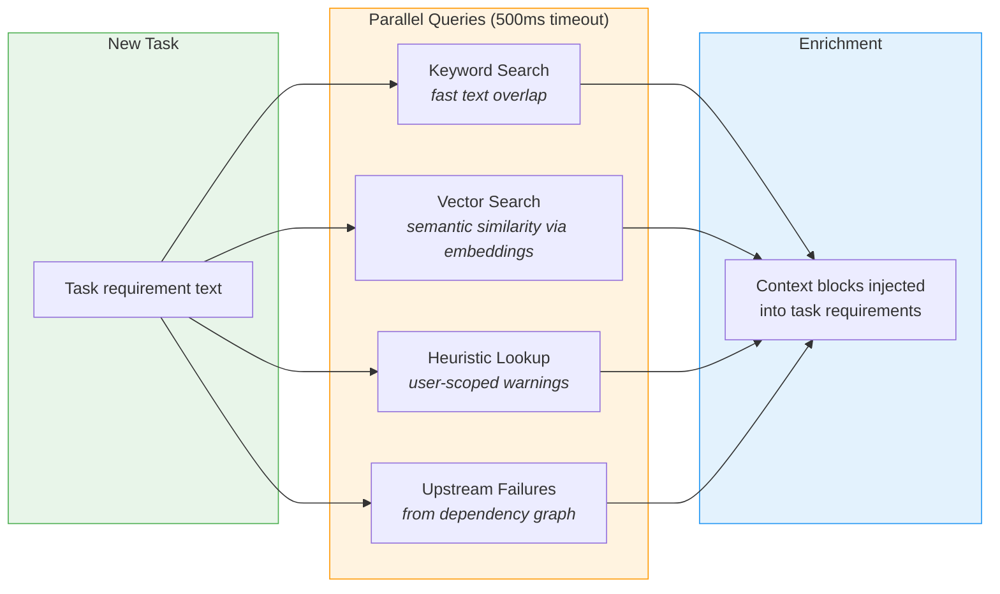
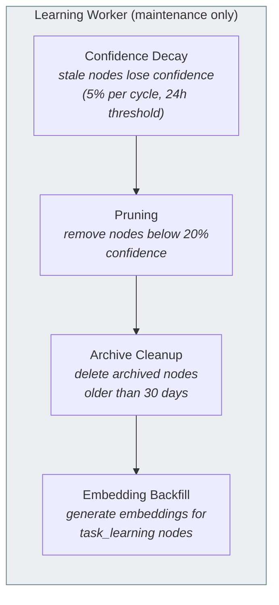
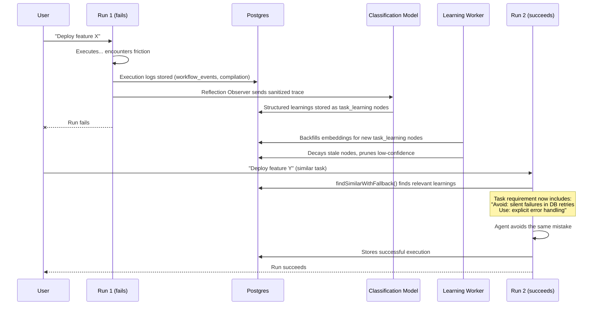

# ALFRED Learning System — How ALFRED Gets Smarter

Owner: agent/orchestrator

## What This Document Covers

This document explains ALFRED's complete learning system — every mechanism that captures experience, stores it, and uses it to improve future work. It is written for someone new to the codebase who wants to understand the "big picture" before diving into code.

**Scope:** This covers ALFRED itself (the orchestrator, pipeline, and agent tooling), not applications that ALFRED generates for users. ALFRED's own development uses the `.ruler/` system (maintained by humans), but executor agents working on external projects do **not** write `.ruler/` files.

## The Big Picture

ALFRED learns from every workflow it runs. The learning system is **LLM-driven** — an LLM synthesizes prescriptive learnings from execution logs rather than using heuristic or rule-based extraction. All automated learnings are stored in Postgres with embeddings for semantic retrieval.

The system has five phases that form a continuous loop:

## Phase 1: Capture — Gathering Experience

### What each mechanism does

| Mechanism               | When it runs        | What it captures                                                         | Where it stores         |
| ----------------------- | ------------------- | ------------------------------------------------------------------------ | ----------------------- |
| **Signals Judge**       | During execution    | Friction (errors, retries, workarounds) and delight (smooth completions) | Pipeline events         |
| **Reflection Observer** | After run completes | LLM-synthesized prescriptive learnings from execution logs               | Postgres `memory_nodes` |
| **Pattern Extraction**  | On workflow success | Successful plan structures stored as reusable templates                  | `workflow_patterns`     |
| **Cognitive Autonomy**  | Continuously        | Confidence level based on success/failure evidence                       | In-memory state         |

### How Reflection Observer works

1. **Gathers context** from existing DB stores (workflow_events, compilation, codex outcomes) via an injected callback
2. **Builds a sanitized trace** — no raw code, file paths, user quotes, or secrets
3. **Calls `generateObject`** with a Zod schema and `getClassificationModel()` (cerebras:gpt-oss-120b)
4. **Persists structured learnings** to `memory_nodes` with `kind=task_learning`, `projectId`, and category/confidence metadata

Each learning is prescriptive ("Use...", "Avoid...", "Check..."), not descriptive. The LLM extracts at most 5 learnings per run, each with a confidence score and category.

## Phase 2: Store — Where Knowledge Lives

All persistent knowledge flows into Postgres. There is one tier for automated learning.

### Storage types explained

**Postgres `memory_nodes`** — The main knowledge table. Every learning gets a row with:

- A **kind** tag (what type: `task_learning`, `heuristic`, `codex_execution`, `fact`, `insight`)
- A **resource** scope (workspace path, matching the query path)
- A **projectId** (UUID FK, nullable — enables project-affinity retrieval)
- A **properties** field (structured metadata: runId, taskId, outcome, source, category, confidence)
- An optional **embedding** (vector for similarity search, backfilled asynchronously)

**`workflow_patterns`** — Successful plan templates. When a workflow succeeds, its plan structure is stored so similar future requests can reuse it.

## Phase 3: Query — Finding Relevant Experience

Before starting new work, ALFRED searches its knowledge base for relevant past experience.

### How similarity search works

1. **Keyword matching** (primary, always available): Extracts meaningful words from the task, computes overlap with past labels. Fast and requires no embeddings.

2. **Vector similarity** (enhanced, when embeddings exist): Uses pgvector cosine distance with project-affinity boosting — results from the same project are ranked higher than global results.

3. **Fallback strategy**: Try vector search first. If no results, fall back to keyword search.

## Phase 4: Apply — Using Knowledge to Improve Runs

Stored knowledge influences new runs at three points:

| Injection Point       | What's Added                                 | Effect                                             |
| --------------------- | -------------------------------------------- | -------------------------------------------------- |
| **Task requirements** | "Similar past task used X approach"          | Agent starts with prior context                    |
| **Task requirements** | "Warning: upstream task failed due to Y"     | Agent avoids known pitfalls                        |
| **Agent prompts**     | Heuristic rules ("always check Z before...") | Agent follows learned rules                        |
| **Plan generation**   | Matching workflow pattern                    | Plan bootstraps from proven template               |
| **Autonomy level**    | Confidence gradient                          | Agent asks for help less often as confidence grows |

## Phase 5: Maintain — Keeping Knowledge Healthy

The Learning Worker runs as a background maintenance loop (hourly by default).

The worker does **not** perform knowledge extraction — that's handled by the LLM-driven Reflection Observer at run completion time.

## End-to-End Flow: A Complete Learning Cycle

## Component Map

Where each piece lives in the codebase:

| Component           | Package             | Key File                                        |
| ------------------- | ------------------- | ----------------------------------------------- |
| Reflection Observer | `@alfred/pipeline`  | `src/observers/reflect.ts`                      |
| Reflection Prompt   | `@alfred/pipeline`  | `src/observers/reflect.prompt.ts`               |
| Signals Judge       | `@alfred/agent`     | `src/signals/judge.ts`                          |
| Learning Worker     | `@alfred/agent`     | `src/orchestrator/learning/` (worker, maintain) |
| Ontology Seeding    | `@alfred/agent`     | `src/orchestrator/learning/extract.ts`          |
| Pattern Extraction  | `@alfred/api`       | `src/services/pattern.ts`                       |
| Observer Wiring     | `@alfred/api`       | `src/routers/workflow/phase/execute.ts`         |
| Plan Enrichment     | `@alfred/plan`      | `src/enrich/index.ts`                           |
| Failure Propagation | `@alfred/plan`      | `src/enrich/propagate.ts`                       |
| Codex Learning Repo | `@alfred/db`        | `src/repo/codex-learning.ts`                    |
| Graph Storage       | `@alfred/db`        | `src/repo/graph/`                               |
| Self-Supervision    | `@alfred/learning`  | `src/self_supervision.ts`                       |
| Cognitive Autonomy  | `@alfred/cognitive` | `src/autonomy/update.ts`                        |

## Key Design Decisions

1. **LLM-driven, not heuristic.** An LLM synthesizes prescriptive learnings from execution traces. No regex detectors, keyword lists, or heuristic extractors. The LLM produces higher-quality, more generalizable insights.

2. **Single tier, Postgres only.** All automated learnings go to `memory_nodes` with embeddings. There is no `.ruler/` write path for executor agents — `.ruler/` is maintained by humans for ALFRED's own development.

3. **Existing logs as input.** The observer reads from already-persisted `workflow_events`, `compilation`, and codex outcomes. No new persistence, just reading what's already there.

4. **Observer pattern, not a pipeline stage.** Reflection runs as an observer (non-blocking, 5s timeout) rather than a pipeline stage. Reflection failures never break the workflow.

5. **Dependency injection for DB access.** The pipeline package never imports `@alfred/db` directly. Two callbacks are injected by the API layer: `gatherContext` (reads) and `persistLearning` (writes).

6. **Resource matches query path.** Learnings are stored with `resource=workspace` (the filesystem path), matching how `findSimilarWithFallback()` queries them.

7. **Project-affinity retrieval.** Learnings are tagged with `projectId` and the query path boosts results from the same project while still surfacing global knowledge.

8. **Gated behind `ALFRED_ENRICHMENT`.** The LLM extraction and persistence only run when `ALFRED_ENRICHMENT=1`.

9. **Maintenance-only worker.** The Learning Worker handles confidence decay, pruning, archive cleanup, and embedding backfill — it does not perform knowledge extraction.

## Related Documents

- [Task Enrichment Architecture](task-enrichment.md) — Deep dive into enrichment data flow
- [Signals Architecture](signals.md) — How friction/delight signals work
- [Pipeline Architecture](pipeline.md) — Observer pattern and stage lifecycle
- [Memory System](memory-system.md) — Knowledge graph and memory node schema
- [ExecPlan: Reflective Learning](../execplans/reflective-learning.md) — Implementation plan and progress
