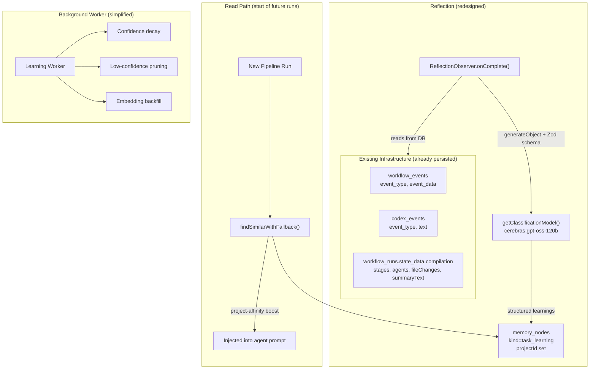

# ExecPlan: Reflective Learning Integration

Owner: agent/orchestrator
Scope: ALFRED itself (orchestrator + agent tooling), not apps ALFRED generates.

## Purpose

Implement an **LLM-driven reflective learning** mechanism that captures per-task learnings from existing execution logs, stores them in Postgres with embeddings for semantic retrieval, and surfaces them to future runs via enrichment queries.

Key constraints:

- Reflection must be **non-blocking**: reflection failures must never fail the run.
- All automated learnings go to **Postgres `memory_nodes`** — the single long-term store.
- An **LLM synthesizes prescriptive learnings** from execution traces — no heuristics, keyword lists, or rule-based extractors.
- **No automated `.ruler/` writes** from executor agents. `.ruler/` is maintained by humans for ALFRED's own development.

Non-goals:

- Writing `.ruler/` files from automated learning (deleted).
- Heuristic-based learning extraction (replaced by LLM).
- Two-tier ephemeral/durable split (simplified to single tier).
- MistakePersistenceAdapter wiring (deleted for simplification).

## Architecture

## Plan

### Completed

#### 1. Delete old infrastructure

- [x] Delete `toolReflect` (`packages/agent/src/orchestrator/tool/reflect.ts`)
- [x] Delete `.ruler/65-reflection.md` (automated `.ruler/` write rules)
- [x] Delete `packages/api/src/services/mistake-adapter.ts` (mistake ledger wiring)
- [x] Delete `packages/agent/test/reflect-tool.test.ts`
- [x] Remove `toolReflect` from agent barrel (`v6.ts`)
- [x] Remove mistake adapter wiring from `init.ts`

#### 2. Create LLM-driven reflection

- [x] Create `reflect.prompt.ts` — prompt template for learning extraction
- [x] Define `learningExtractionSchema` — Zod schema for structured LLM output
- [x] Rewrite `ReflectionObserver.onComplete()` to use `generateObject` + `getClassificationModel()`
- [x] Define `GatherExecutionContextFn` — callback type for reading existing DB stores
- [x] Define updated `PersistLearningFn` — includes category, confidence, source: "llm"

#### 3. Wire in execute.ts

- [x] Build `gatherContext` callback reading from `workflowRepo.listEventsByType` + `getRun`
- [x] Fix resource mismatch: use workspace path instead of `run:<uuid>`
- [x] Pass `workspace` (not `rootDir`) to observer config

#### 4. Simplify learning worker

- [x] Gut `extract.ts` — keep only `seedOntology()` and `learnDomainCorrection()`
- [x] Simplify `worker.ts` — maintenance-only loop (decay, pruning, backfill)
- [x] Simplify `types.ts` — remove extraction-specific config (batchSize, intervalMs)

#### 5. Update tests and docs

- [x] Rewrite observer tests for LLM-driven flow
- [x] Update `docs/architecture/learning-system.md`
- [x] Update this ExecPlan

## Acceptance Criteria

### AC-1: LLM-driven learning synthesis

- `ReflectionObserver.onComplete()` calls `generateObject` with `learningExtractionSchema` and `getClassificationModel()`.
- Each learning has: `insight` (20-300 chars, prescriptive), `category`, `confidence` (0-1).
- Maximum 5 learnings per run.

### AC-2: Existing logs as input

- Observer gathers context from already-persisted `workflow_events` (errors, tool-results, agent-complete) and `workflow_runs.state_data.compilation` via injected callback.
- No new persistence for input data — only reads existing stores.

### AC-3: Single-tier Postgres storage

- All learnings stored as `memory_nodes` with `kind=task_learning`, `resource=workspace`, `projectId` set.
- No `.ruler/` writes from automated learning.
- No AgentFS KV for learnings.

### AC-4: Non-blocking observer

- `ReflectionObserver` uses `Promise.race` with 5s timeout.
- LLM failure, context-gathering failure, and persistence failure all degrade to logged warnings.
- Never changes run exit status.

### AC-5: Gated behind env flag

- The LLM call and persistence only execute when `ALFRED_ENRICHMENT=1`.
- When enrichment is off, observer is a no-op.

### AC-6: Dependency injection

- `@alfred/pipeline` never imports `@alfred/db` directly.
- Two callbacks injected: `gatherContext` (reads) and `persistLearning` (writes).

### AC-7: Resource matches query path

- Learnings stored with `resource=workspace` (filesystem path), matching how `findSimilarWithFallback()` queries them.

### AC-8: Maintenance-only worker

- Learning Worker only handles: confidence decay, low-confidence pruning, archive cleanup, embedding backfill.
- No knowledge extraction from completed runs (that's the observer's job).

## Progress

- [x] (2026-02-03) Original Stage 1 tooling (MVP) exists
- [x] (2026-02-07) ExecPlan updated multiple times as architecture evolved
- [x] (2026-02-07) Codebase overlap audit — no duplication confirmed
- [x] (2026-02-07) Original `toolReflect` + `ReflectionObserver` implemented (heuristic-based)
- [x] (2026-02-07) Fixed ephemeral storage: replaced AgentFS KV with Postgres `memory_nodes`
- [x] (2026-02-07) Implemented project-affinity scoping for learnings
- [x] (2026-02-07) **Architectural pivot**: replaced entire heuristic-based system with LLM-driven approach
- [x] (2026-02-07) Deleted `toolReflect`, `.ruler/65-reflection.md`, `mistake-adapter.ts`
- [x] (2026-02-07) Rewrote `ReflectionObserver` with LLM synthesis via `generateObject`
- [x] (2026-02-07) Created `reflect.prompt.ts` and `learningExtractionSchema`
- [x] (2026-02-07) Wired `gatherContext` callback in `execute.ts` reading from existing DB stores
- [x] (2026-02-07) Fixed resource mismatch (workspace path instead of `run:<uuid>`)
- [x] (2026-02-07) Gutted `learning/extract.ts` (kept `seedOntology` + `learnDomainCorrection` only)
- [x] (2026-02-07) Simplified `worker.ts` to maintenance-only loop
- [x] (2026-02-07) Rewrote observer tests for LLM-driven flow
- [x] (2026-02-07) Updated architecture docs

## Surprises & Discoveries

- (2026-02-07) The original "two-tier" design (ephemeral Postgres + durable `.ruler/`) caused confusion between ALFRED development (where `.ruler/` is appropriate) and ALFRED executor agents (where it's not).
- (2026-02-07) Heuristic-based `buildLearnings()` produced low-quality learning content that was essentially string manipulation of friction descriptions rather than genuine insight synthesis.
- (2026-02-07) Existing execution logs (`workflow_events`, `compilation`, `codex_events`) are a rich, already-persisted source of learning input that was being completely ignored in favor of simple friction descriptions.
- (2026-02-07) The `resource` field mismatch (`run:<uuid>` vs workspace path) meant the read path (`findSimilarWithFallback`) could never actually find learnings written by the observer.

## Decision Log

- (2026-02-07) Decision: LLM-driven learning synthesis replaces all heuristic extraction.
  Rationale: Heuristics produce low-quality, descriptive learnings. LLMs synthesize prescriptive, actionable insights from rich execution traces.

- (2026-02-07) Decision: Single tier — Postgres `memory_nodes` only.
  Rationale: `.ruler/` files are not a database. Embeddings enable semantic retrieval. Postgres is the true long-term store.

- (2026-02-07) Decision: No automated `.ruler/` writes from executor agents.
  Rationale: `.ruler/` is for ALFRED's own development (maintained by humans). Executor agents working on external projects should not write `.ruler/` files.

- (2026-02-07) Decision: Use existing execution logs as LLM input.
  Rationale: `workflow_events`, `compilation`, and `codex_events` are already persisted. No need for new persistence — just read what's there.

- (2026-02-07) Decision: Maintenance-only learning worker.
  Rationale: Knowledge extraction from completed runs is now handled by the LLM-driven observer at run completion time. The worker only needs to maintain the knowledge graph.

## Outcomes & Retrospective

The system was redesigned from a heuristic-based two-tier system to an LLM-driven single-tier system. Key improvements:

1. **Higher quality learnings** — LLM synthesis produces prescriptive, actionable insights instead of string-manipulated friction descriptions.
2. **Simpler architecture** — one storage tier (Postgres), one extraction mechanism (LLM in observer), one maintenance loop (worker).
3. **Leverages existing infrastructure** — reads from already-persisted execution logs instead of building new persistence.
4. **Clean boundaries** — pipeline never imports DB; callbacks injected at API layer; observer is non-blocking.
